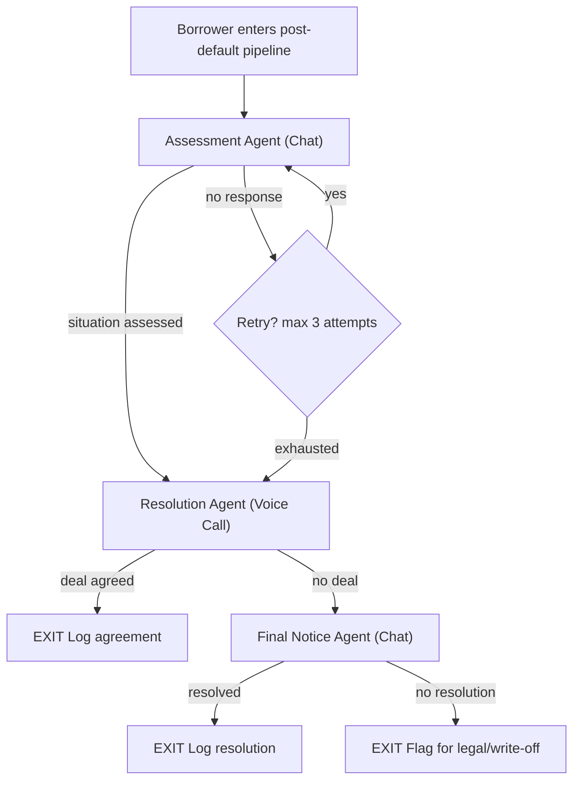

# Riverline Hiring Assignment - Engineers

### Before You Begin

A note on AI tools. You may use any AI coding assistant, including Claude, Copilot, or GPT. We assume you will use Claude Opus 4.6. This changes what we're evaluating. We are not testing whether you can produce code. We are testing whether you understand what you built, can defend your decisions under live questioning, can modify your system under novel constraints on the spot, and made genuine engineering trade-offs that reflect judgment, not generation. Your submission will be followed by a live technical session with no AI assistance. If you cannot navigate your own codebase fluently, explain your statistical methodology, and adapt your system live, your submission quality is irrelevant.

### General Guidelines

- Keep your code short and concise.
- Feel free to use any tools that help you solve this assignment.
- The assignment is designed to be hard and lengthy. Starting early will help.
- There are no right answers. Approach matters more than correctness.
- Make suitable assumptions wherever you feel things are not defined, since it is meant to be open-ended.
- The submission details are at the end of this document.
- Reach out to us if you have any queries ([jayanth@riverline.ai](mailto:jayanth@riverline.ai))
- The deadline (mentioned on the email) will be strict, no extensions! So, plan accordingly.

### Challenge: Self-Learning AI Collections Agents

You're building a post-default debt collections system with three AI agents operating behind a single continuous borrower experience. The borrower interacts with what feels like one system. Behind the scenes, a Temporal ([temporal.io](http://temporal.io)) workflow orchestrates handoffs between three specialized agents, two over chat and one over voice. Each agent has a self-learning loop that autonomously improves its own performance, and the loop itself evolves its own evaluation methodology over time.

A borrower has defaulted on their loan. Your system engages them through a pipeline that progresses through three stages. The borrower should never feel a handoff. No re-introductions, no repeated questions, no jarring tone shifts. One continuous experience, three agents behind it, two modalities.

### The Three Agents

**Agent 1: Assessment (Chat)**

Cold, clinical, all business. This agent establishes the debt, verifies the borrower's identity using partial account information, and gathers their current financial situation. It doesn't negotiate. It doesn't sympathize. It gathers facts and determines which resolution path is viable.

**Agent 2: Resolution (Voice)**

Transactional dealmaker. This agent calls the borrower on the phone to present settlement options (lump-sum discount, structured payment plan, hardship referral) with clear deadlines and conditions. It handles objections by restating terms, not by comforting. It anchors on policy-defined ranges and pushes for commitment. Use any voice provider or framework (Pipecat, Vapi, Retell, Bland, etc.).

**Agent 3: Final Notice (Chat)**

The closer. This agent is consequence-driven, deadline-focused, and leaves zero ambiguity. It lays out exactly what happens next: credit reporting, legal referral, asset recovery. It makes one last offer with a hard expiry. It doesn't argue, doesn't persuade. It states facts and waits.

The progression is **information, then transaction, then ultimatum**. The modality shift is intentional. Assessment gathers facts over chat. Resolution negotiates over voice, where tone, pacing, and real-time objection handling matter. Final Notice returns to chat for a documented, written record of the last offer and consequences.

### Cross-Modal Handoffs

The handoff from chat to voice and back is a core engineering challenge.

When Agent 1 (chat) hands off to Agent 2 (voice), the borrower should receive a call that picks up exactly where the chat left off. Agent 2 already knows who the borrower is, what they owe, and what their situation is. No re-verification, no "can you tell me about your account."

When Agent 2 (voice) hands off to Agent 3 (chat), everything that was said on the phone call (offers made, objections raised, borrower's stated position) must be captured and passed to Agent 3 in chat. The borrower's chat thread should read as a coherent continuation, with Agent 3 referencing what was discussed on the call.

How you achieve this is an architectural decision you must make and justify.

### Context Budget

Each agent operates under a strict token budget.

- **Total context window:** 2000 tokens per agent. This includes the agent's system prompt and any handoff context from prior stages. A richer system prompt means less room for context. A minimal system prompt means more room but potentially worse agent behavior. You have to make this tradeoff.
- **Handoff context:** Within that 2000-token window, a maximum of **500 tokens** can be allocated to the handoff summary from prior stages.
    - **Agent 1** starts fresh. No prior context needed. Full 2000 tokens available for its system prompt.
    - **Agent 2** receives a maximum of 500 tokens summarizing Agent 1's chat conversation. Remaining 1500 tokens for its system prompt.
    - **Agent 3** receives a maximum of 500 tokens summarizing the full history: Agent 1's chat and Agent 2's voice call. Remaining 1500 tokens for its system prompt.

This forces you to build a summarization layer that preserves critical information (identity verified, financial situation, offers made, objections raised, borrower's emotional state) within a hard constraint. If your summary drops something important, the next agent will ask for it again and the borrower feels the seam. If your summary is bloated with irrelevant detail, you waste your budget and miss what matters.

These budgets must be enforced in code and evidenceable. We will inspect your implementation to verify the constraints are real, not aspirational.

Additionally, the entire self-learning loop (all iterations, all simulated conversations, all evaluations across all three agents) must run within **$20 of total LLM API spend**. Report your actual cost with a breakdown: how many conversations simulated, how many evaluation calls, how many prompt-generation calls. This forces efficient evaluation design: smart sampling, appropriate model selection for simulation vs evaluation, and batched operations.

### Workflow Orchestration

Use Temporal to orchestrate one workflow per borrower. The workflow is a simple linear pipeline with outcome-based transitions. Temporal handles state persistence, timeouts between stages, and retry policies.

### Self-Learning Loop

Each agent must autonomously improve its performance over time. We are not prescribing how you build the metrics, the evaluation mechanism, or the improvement approach. You design all of that. You can use LLM-as-a-judge, but everything must be quantitative.

You decide:

- What to measure and how
- How to propose changes to an agent's prompt or behavior
- How to evaluate whether a proposed change is a genuine improvement
- What threshold a change must clear before being adopted

There are four hard requirements:

1. **Quantitative justification.** Show, with numbers, why a prompt update was adopted or rejected. "An LLM said it's better" is not sufficient. "Resolution rate went from 40% to 45%" is also not sufficient, that could be noise on a small sample. Your system must account for this.
2. **Compliance preservation.** No prompt update may introduce compliance violations (see compliance rules below). Performance gains that break compliance are invalid.
3. **Audit trail.** Every prompt version stored with its evaluation data. The full evolution of each agent's prompt should be traceable.
4. **Rollback capability.** If a deployed version underperforms, the system can revert to a previous version.

Keep in mind that a prompt change that improves one agent's metrics could degrade the handoff experience or break conversation continuity. The self-learning loop must evaluate at the system level, not just per-agent.

To generate conversations for evaluation, build a test harness where your agents converse with an LLM playing the borrower. Your test harness should cover a realistic range of borrower behaviors: cooperative, combative, evasive, confused, distressed. The quality of your evaluation coverage is part of the assessment.

### The Darwin Godel Machine Requirement

The self-learning loop does not just improve the agents. It must also be able to evaluate and improve its own evaluation methodology.

Your metrics might be wrong. Your threshold for adopting changes might be too aggressive or too conservative. Your compliance checker might have blind spots. The system should be able to identify when its own evaluation framework is producing unreliable results and propose changes to it.

Concretely, you must demonstrate at least one case where the meta-evaluation layer caught a flaw in the primary evaluation (a metric that was misleading, an evaluation that was too lenient, a blind spot in compliance checking) and corrected it. This is the core idea behind the [Darwin Godel Machine](https://sakana.ai/dgm/) by Sakana AI: a system that doesn't just improve its outputs, but improves its ability to judge its own outputs.

### Compliance Rules

All three agents must adhere to the following at all times, including after any prompt update from the self-learning loop.

1. **Identity disclosure.** The agent must identify itself as an AI agent acting on behalf of the company at the start of the conversation. It must never imply that it is human.
2. **No false threats.** Never threaten legal action, arrest, or wage garnishment unless it is a documented next step in the pipeline. No fabricated consequences.
3. **No harassment.** If the borrower explicitly asks to stop being contacted, the agent must acknowledge and flag the account. No continued outreach after explicit refusal.
4. **No misleading terms.** Settlement offers must be within policy-defined ranges. No invented discounts or unauthorized promises.
5. **Sensitive situations.** If the borrower mentions financial hardship, medical emergency, or emotional distress, the agent must offer to connect them with a hardship program. Do not pressure someone who has stated they are in crisis.
6. **Recording disclosure.** Inform the borrower that the conversation is being logged or recorded.
7. **Professional composure.** Regardless of borrower behavior, the agent must maintain professional language. It may end the conversation politely if the borrower becomes abusive.
8. **Data privacy.** Never display full account numbers, personal details, or other sensitive identifiers. Use partial identifiers for verification.

### Deliverables

**Working System**

- Temporal workflow orchestrating the 3-agent pipeline
- Two chat agents and one voice agent
- Cross-modal handoff mechanism with context summarization
- Test harness for generating and evaluating conversations
- Self-learning loop with meta-evaluation capability
- Docker Compose setup that runs the full system (Temporal server, workers, agents) on a fresh machine within 5 minutes

Your system must be live and runnable at all times after submission. We will trigger conversations through your system and evaluate the live output. During the technical interview, you will be asked to make live changes to your running system.

**Evolution Report**

For each agent, show:

- How the prompt evolved over iterations
- The quantitative data behind each adoption or rejection
- Metrics across prompt versions
- Any regressions detected and how they were handled
- At least one case where the meta-evaluation layer caught a flaw in the primary evaluation
- Total LLM API spend across the entire learning loop with cost breakdown

We want to see raw numbers, not summaries. Show per-conversation scores, distribution of outcomes, variance. A mean improvement of 8% with a standard deviation of 40% is not an improvement. Treat this like a scientific experiment, because it is one.

**Reproducibility**

Your evolution report must be reproducible. Include:

- The exact seed/config to regenerate your test conversations
- A single command that reruns your evaluation pipeline end-to-end
- Raw data files (CSV/JSON) with per-conversation scores

We will rerun your evaluation. If your reported numbers don't match within a reasonable tolerance, your submission is invalidated.

**Technical Writeup**

- Architecture: system design, cross-modal handoff mechanism, how context flows between agents under the 500-token budget
- Self-learning approach: what you measure, how you evaluate, why you designed it this way
- Meta-evaluation: how the loop evaluates itself, what it caught, what it changed
- Compliance: how you ensure prompt updates don't violate rules
- Limitations: what doesn't work well, what you'd improve with more time

A note on ambition. The simplest valid submission is a system that works. The best submissions will make us question our assumptions about the problem. If you think the three-stage linear pipeline is suboptimal, say so and show us what's better. If you think the self-learning framing has fundamental limitations, articulate them. We're hiring engineers who think about problems, not just solve specs.

### Evaluation Criteria

| Criteria | What we're looking for |
| --- | --- |
| Self-learning loop | Evaluation rigor, quantitative justification, meta-evaluation, compliance preservation |
| Temporal workflow | State management, retry logic, activity boundaries, cross-modal handoff design |
| Agent quality | Collections performance across borrower behaviors, compliance, conversation continuity across modalities |
| Context management | Summarization quality under 500-token budget, information preservation across handoffs |
| Code quality | Typed, clean, structured, tested where it matters |
| Writeup | Clarity, architectural reasoning, honest trade-off analysis |

### Constraints

- **Time:** 5 days from assignment date
- **Language:** TypeScript or Python (or both)
- **LLM:** Any
- **Voice:** Any provider or framework
- **Orchestration:** Temporal (required)
- **Context budget:** 2000 tokens total per agent, 500 tokens max for handoff context
- **Learning loop budget:** $20 total LLM API spend
- No starter kit. Build from scratch.

### Decision Journal (Mandatory)

Alongside your code, submit a handwritten decision journal. This must be written by you, not generated by an LLM. We will verify this.

The journal must include timestamped entries covering:

- At least 3 architectural decisions where you chose between alternatives. For each: what were the options, what did you try, what failed, why did you pick what you picked.
- At least 2 moments where you were wrong or stuck. What was the mistake, how did you discover it, how did you recover.
- At least 1 thing you intentionally chose NOT to build and why.

This is not a polished document. We're looking for raw engineering thinking. If every entry reads like a blog post, we'll assume it was generated. We want friction, false starts, and real reasoning. You can add your rough notes, simple charts and scribbles.

### Submission Checklist

- A public GitHub repo with a detailed README file
- Docker Compose setup that runs the full system in under 5 minutes
- Evolution report with raw data, per-conversation scores, and statistical analysis
- Reproducibility artifacts (seeds, configs, single rerun command, raw data files)
- Decision journal with timestamped entries
- Technical writeup (can be in the README or a separate document)
- Cost breakdown of LLM API spend during the learning loop
- An audio recording of a conversation with the voice agent (Agent 2)
- A short demo (2-3 minutes) walking through the system

<aside>
👉

Once you're done, send your submissions to [jayanth@riverline.ai](mailto:jayanth@riverline.ai)

</aside>